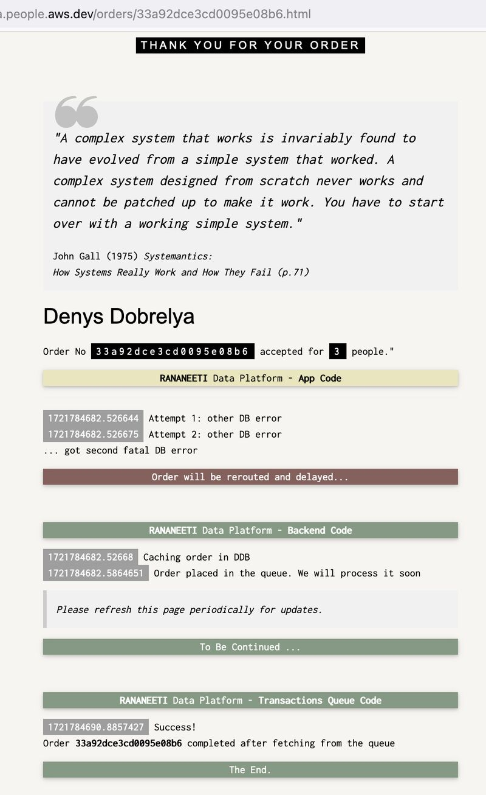
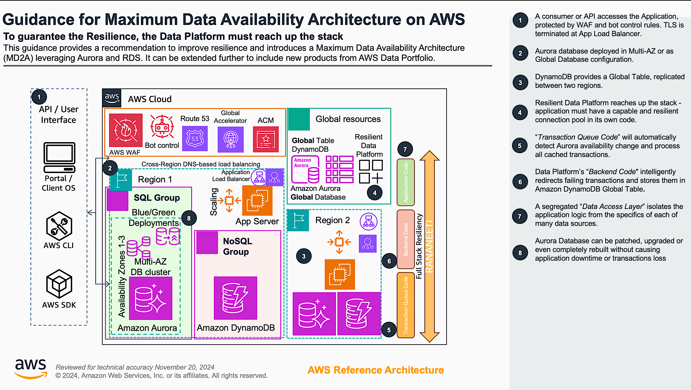
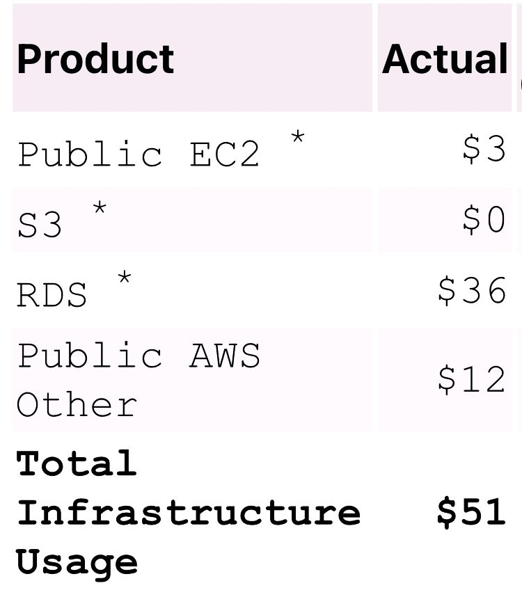
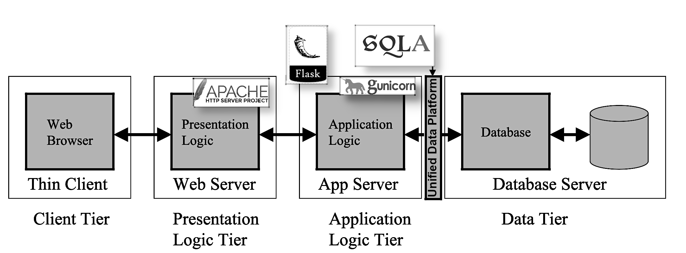

# Guidance for Maximum Data Availability Architecture on AWS
## (aka "MD2A" and "Rananeeti")

## Table of Content
1. [Overview](#overview)
    - [Cost](#cost)
2. [Background](#background)
3. [Cafe Demo App deployment process](#cafe-demo-app-deployment-process)
    - [Prepare the account](#prepare-the-account)
    - [Deploy Salesforce Lightning Web Component](#deploy-salesforce-lightning-web-component)
4. [Deployment Validation](#deployment-validation)
5. [Running the Guidance](#running-the-guidance)
    - [Supported Media Files](#supported-media-files)
6. [Next Steps](#next-steps)
7. [Cleanup](#cleanup)
8. [Notices](#notices)
9. [Authors](#authors)

## Overview
MD2A uses Aurora Global and Dynamo databases, Intelligent-Tiering S3 storage, global traffic management, application firewall and balancing infrastructure. These services, via their own programming APIs and SDKs, get engaged as necessary by our new _“Rananeeti”_ Data Platform which can deliver the _"Full Stack Resiliency"_, working with Application _in its entirety_, covering User Interface, Services and Database layers, as presented in the [Reference Architecture](#ArchDiag) diagram.

### What are we deploying?
The main idea is to _make your application resilient to database failures_.
This is how it looks like for our Cafe Demo Application:
<!-- (link to your URL) -->

The video, detailed explanations and build guide follow.

### Architecture Diagram

The fully deployed production grade system have structure, similar to this:

Aurora Global Database and Amazon DynamoDB are powerful tools that can significantly enhance operational excellence by 1/ _replicating data_ across multiple Availability Zones and _Regions_; 2/ maintaining  continuous operations and _minimizing downtime_; 3/ _automating_ many database management tasks, such as backups, patching, and failover; 4/ with its high-performance storage engine, Aurora Global Database delivers low-latency performance, improving application responsiveness and providing _cross-regional availability_ at the same time; 5/ DynamoDB is a _fully managed_ NoSQL database that eliminates the need for database administration; 6/ DynamoDB _Global Tables_ enable low-latency access to data from multiple regions, which is ideal for applications with _global users_ and improves user experience.

### Cost
You are responsible for the cost of the AWS services used while running this Guidance. As of December 2024 _my cost_ of running this Guidance in the _us-east-1_ region is approximately _$55_ per month. \
 \
_Your cost may and will vary_.

## Background
You can read about *Application-level Resiliency* on 
[my LinkedIn page](https://www.linkedin.com/in/denys-dobrelya/):
- [Working Demo Application walkthrough](https://www.linkedin.com/posts/activity-7222454561465073664-metD), full resolution video is available upon request
- [Reference Architecture](#ArchDiag) diagram, describing all moving parts
- Main ideas behind "*Maximum Data Availability Architecture*" (MD2A):
   - [Building Resilient Applications: Leveraging Modern Databases for High Availability](https://www.linkedin.com/pulse/building-resilient-applications-leveraging-modern-high-denys-dobrelya-pcpqf)
   - [Building for the Future: Why Your Applications Need a Data Platform Foundation](https://www.linkedin.com/pulse/building-future-why-your-applications-need-data-denys-dobrelya-uzhaf)
   - [Business Summary: Deploying Aurora as a Global Cross-Region Database](https://www.linkedin.com/pulse/business-summary-deploying-aurora-global-cross-region-denys-dobrelya-o4wpf)
   - [Multi-Region Resilient Application Recipe](https://www.linkedin.com/pulse/multi-region-resilient-application-recipe-denys-dobrelya-cwjrf)
   - [Building a Cloud Fortress](https://www.linkedin.com/pulse/building-cloud-fortress-denys-dobrelya-b30wf)
- [Fully functional Cafe Demo website](https://cafe.olddba.people.aws.dev) is still available,
but we were asked to restrict public access. If you want to try it - let me know! 
(_It looks and works exactly like in my video above._)

## Cafe Demo App deployment process
By leveraging cloud computing and AWS managed services, _“Rananeeti” can reduce its carbon footprint_ significantly. AWS data centers are highly energy-efficient, utilizing advanced cooling technologies and renewable energy sources. AWS is committed to sustainable practices, such as reducing waste and optimizing resource usage.

### Prepare the account
-  Get new AWS Account
   So you don't mess up your things at work!
-  Use N.Virginia "us-east-1" region
   You may use any region you wish, but then you need to change the default value of CloudFormation parameter "HostAMI" 
-  Create a KeyPair and name it "cafe-keypair" or provide your own name as CloudFormation parameter "CafeKey"
-  Run the CloudFormation (CF from now) and deploy the stack "Cafe"
   Use file "deployment/Cafe_template.yaml"
   Aurora DB creation takes the longest time - be patient for about 15 min.
   Once everything is ready read the "Output" section and add your own IP to the Security Group.
- Connect to EC2 via ssh using your KeyPair.
   This is your Application server and all Flask App code will be deployed here.
   It is already configured to connect to empty Aurora PG database, just run "psql" from command line.
   This Git Repo code had already been cloned into "/home/ec2-user/md2a/rananeeti/olddba".
   Go there.
- Now we need to deploy [this target stack](https://www.linkedin.com/pulse/building-resilient-applications-leveraging-modern-high-denys-dobrelya-pcpqf).

This image "maps" old (_but not useless!_) "legacy" Enterprise world with newer lightweight approach.

### Supported Regions

This Guidance is built for regions that support Amazon Kendra. Supported regions are subject to change, so please review [Amazon Kendra endpoints and quotas](https://docs.aws.amazon.com/general/latest/gr/kendra.html) for the most up-to-date list. Attempting to deploy the CDK stack in a region where Amazon Kendra in unavailable will fail.

## Deployment Steps
This project consists of two components, which have to be deployed separately.  One to Salesforce, and one to AWS.

**BEFORE DEPLOYING**
This requires a certificate that can be used in both Salesforce and AWS.  For _DEV_ purposes, a self-signed cert is the easiest, but must be initiated on the Salesforce side.

### Generate Certificates
1. **Generate Certificates**: In the target Salesforce org, go to Setup > Certificate and Key Management > Create Self-Signed Certificate.
    * Here are instructions from Salesforce for creating a self-signed certificate: [Generate a Self-Signed Certificate](https://help.salesforce.com/s/articleView?id=sf.security_keys_creating.htm&type=5).
    * **Important:** Name that certificate `awsJWTCert`.  The component will only look for a certificate with that name.
2. Create and download the certificate.
3. There are 2 options for providing the public certificate to your AWS infrastructure:
   1. Overwrite [deployment/media-management-solution-cdk/cert.crt](deployment/media-management-solution-cdk/cert.crt) with the new certificate you just downloaded.
   2. In [app.py](deployment/media-management-solution-cdk/app.py), the path to the public certificate file is stored in the `pub_cert_path` variable. If you want to use a different file or location for the public certificate, you need to modify the value of the `pub_cert_path` variable with the path to your cert for the CDK to read in the values.

### Deploy AWS
1. The CDK must first be deployed on AWS to create the necessary resources needed for the Salesforce Lightning Web Component (LWC).
2. Follow the instruction on [Media Management CDK](deployment/media-management-solution-cdk/README.md) to configure and deploy the CDK stack in your AWS Account.
3. The outputs that will be used in configuring the Salesforce LWC can be found in the CloudFormation outputs tab, or in the CDK CLI after a successful deployment:

### Deploy Salesforce Lightning Web Component
1. Have the Salesforce CLI installed. Here are instruction to install: [Install Salesforce CLI](https://developer.salesforce.com/docs/atlas.en-us.sfdx_setup.meta/sfdx_setup/sfdx_setup_install_cli.htm)
2. Change directories to the `deployment/sfdc` directory
3. If this is your first time using the Salesforce CLI, you must first authorize your org with the CLI. Here is the [Authorization](https://developer.salesforce.com/docs/atlas.en-us.sfdx_dev.meta/sfdx_dev/sfdx_dev_auth.htm) guide. Use the option that best meets your needs. The option that meets most user's needs is [Authorize an Org Using a Browser](https://developer.salesforce.com/docs/atlas.en-us.sfdx_dev.meta/sfdx_dev/sfdx_dev_auth_web_flow.htm)

4. Run `sf project deploy start`.
   * Depending on your authorization and configuration, you may need to specify the directory and target org with additional tags. Here is an example of how this might look like: `sf project deploy start  --source-dir deployment/sfdc --target-org <org-alias>`
   * Here is a [Salesforce CLI Command Reference](https://developer.salesforce.com/docs/atlas.en-us.sfdx_cli_reference.meta/sfdx_cli_reference/cli_reference_project_commands_unified.htm#cli_reference_project_deploy_start_unified)

## Deployment Validation

Now that the Salesforce LWC and AWS CDK are deployed, you will need to add the LWC to your Case Page Layout, and insert the values of the S3 buckets, API Gateway, and Kendra ID. We are going to use the [Lightning App Builder](https://help.salesforce.com/s/articleView?id=sf.lightning_app_builder_overview.htm&type=5) to configure the Case Page and add the custom LWC to Cases.
1. Follow this guide,[Create and Configure Lightning Experience Record Pages](https://help.salesforce.com/s/articleView?id=sf.lightning_app_builder_customize_lex_pages.htm&type=5), and use your preferred method of creating a Lightning App Builder for the Cases page.
2. In the Lightning App Builder page for the Cases, add the `AWS S3 Media Files` component to pages as desired.
3. Use the outputs from the CDK Deployment for the required inputs of the `AWS S3 Media Files` component:

4. Open up a sample case, and hit Refresh on the *AWS Files* Component. If you do not get any errors, the LWC was configured correctly.
5. Next step is to upload media files.

### Common Misconfigurations
- The most common reason why you would get an error is because of the self-signed certificate. Here are some things to check:
  - Review the [generate certificates](#generate-certificates) section and make sure that you have followed all the steps.
    - Make sure that the certificate is named `awsJWTCert`

## Running the Guidance

When running this solution, each case will generate a new prefix in the input S3 Bucket to keep inputs seperated from each other.

In this example, you can see that a JPG image and MOV video file were successfully uploaded.

The processing in AWS runs asynchronously, so the results may take a few seconds to load. When looking at the outputs of an Image File, you will see the image metadata, image location, and results of Amazon Rekognition.

When looking at the outputs of a Video File, you will see the video preview, and the transcription with timestamps. There is also an option to download the transcription.

Here is a sample output of the Document generated.

### Supported Media Files

Because of the format compatibility of Amazon Transcribe and Amazon Rekognition, only the following file formats are supported. Any formats not present here, will still be stored in S3, but will not be processed by its respective pipeline.
- Image File Formats: "jpg", "jpeg", "png"
  - Here are the [Image specifications](https://docs.aws.amazon.com/rekognition/latest/dg/images-information.html) for Amazon Rekognition
- Video File Formats: "mpeg4", "mp4", "mov", "avi"
  - Here are the [Video specifications](https://docs.aws.amazon.com/rekognition/latest/dg/video.html) for Amazon Rekognition
- Audio File Formats: "amr", "flac", "m4a", "mp3", "mp4", "ogg", "webm", "wav"
  - Here are the [Data input and output](https://docs.aws.amazon.com/transcribe/latest/dg/how-input.html) for Amazon Transcribe

## Next Steps

This Guidance establishes the basis for securely storing and processing media files using AI/ML by connecting AWS and Salesforce. Customers can improve this by incorporating additional data processing or personalized AI/ML models, resulting in a more tailored solution for their specific needs. Customers have the option to include extra audio transcript processing for summary generation via [Amazon Bedrock](https://aws.amazon.com/bedrock/) for GenAI.

## Cleanup
### Delete Stack
To clean up environment, AWS resources can be deleted using the CDK or CloudFormation. With CDK, run the `cdk destroy` command to delete the resources. With CloudFormation, you can go to the CloudFormation stack and click `Delete`
### Manually delete retained resources
After deleting the stack, there will be some resources that will be retained. You will need to manually delete these resources.
- Amazon S3 buckets will be retained:
  - `InputBucket`
  - `OutputBucket`
  - `TranscriptionBucket`
  - `LoggingBucket`
- Amazon Elastic Container Registry (ECR) will be retained:
  - `json2word_repo`
  - `exif_tool_repo`
  - `encoder_repo`
- In the EC2 Image Builder service, 3 container recipes and 1 infrastructure configurations will be retained.
  - Container recipes:
    - `json2word_recipe`
    - `exif_tool_recipe`
    - `encoder_recipe`
  - Infrastructure configurations:
    - `InfrastructureConfigurationContainerStack`

## Notices

**External Library Notice:**
*An external FFmpeg binary will be pulled from [https://www.johnvansickle.com](https://www.johnvansickle.com) for the [Encoder Dockerfile](deployment/media-management-solution-cdk/media_management_solutions_library/container_assets/EncoderRecipe/) container. It is the responsibility of the customer to abide by the licensing of FFmpeg.*
*An external exif binary will be pulled from [exiftool.org](https://exiftool.org/)
[https://github.com/exiftool/exiftool](https://github.com/exiftool/exiftool) for the [ExifTool Dockerfile](deployment/media-management-solution-cdk/media_management_solutions_library/container_assets/ExifToolRecipe) container. It is the responsibility of the customer to abide by the licensing of [ExifTool](https://github.com/exiftool/exiftool).*

**Legal Disclaimer:**
*Customers are responsible for making their own independent assessment of the information in this Guidance. This Guidance: (a) is for informational purposes only, (b) represents AWS current product offerings and practices, which are subject to change without notice, and (c) does not create any commitments or assurances from AWS and its affiliates, suppliers or licensors. AWS products or services are provided “as is” without warranties, representations, or conditions of any kind, whether express or implied. AWS responsibilities and liabilities to its customers are controlled by AWS agreements, and this Guidance is not part of, nor does it modify, any agreement between AWS and its customers.*

## Authors and Contributors

- John Meyer - Salesforce Solutions Engineer (Retired)
- John Sautter - Salesforce Senior Director of Solutions Engineering
- Kyle Hart - AWS Principal Solutions Architect
- Christian Ramirez - AWS Partner Solutions Architect
- Jared Wiener - AWS Senior Solutions Architect
- Kishore Dhamodaran - AWS Senior Solutions Architect
- Robert Sosinski - AWS Principal Solutions Architect
- Deepika Suresh - AWS Solutions Architect Technology Solutions
- Jason Wreath - AWS Head of Solutions for AIML & Data
